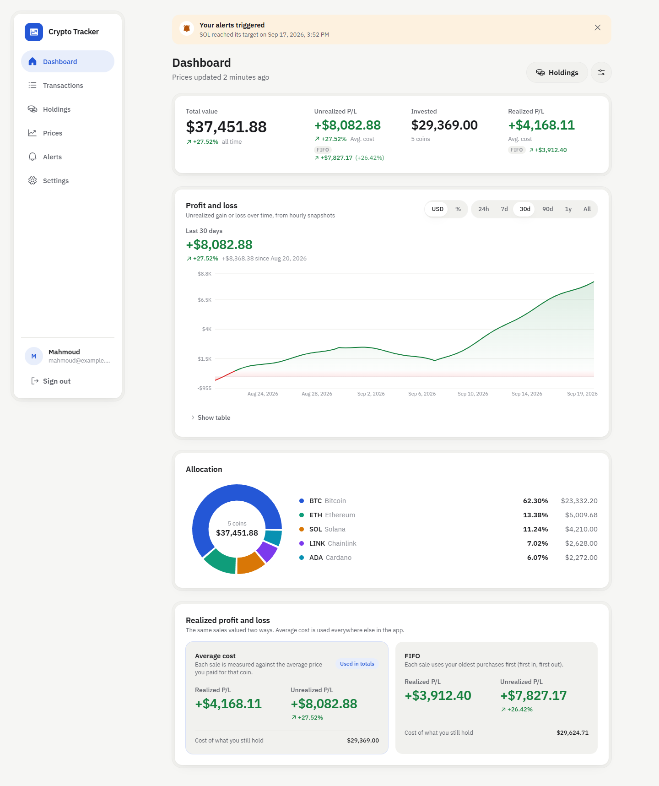
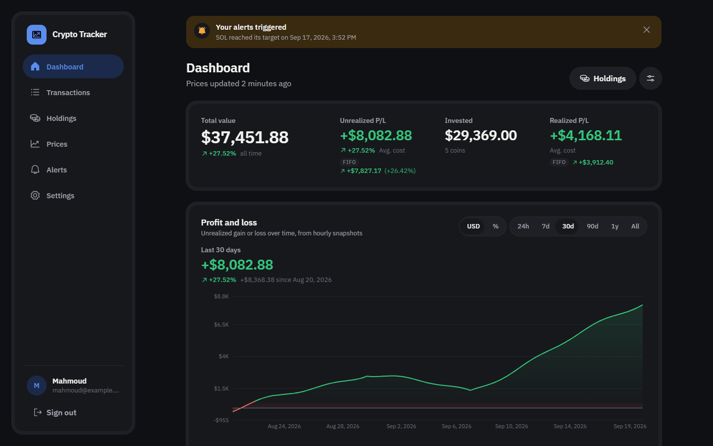
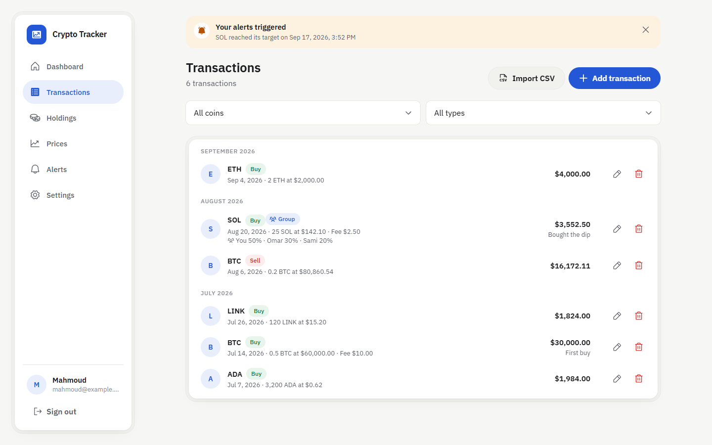
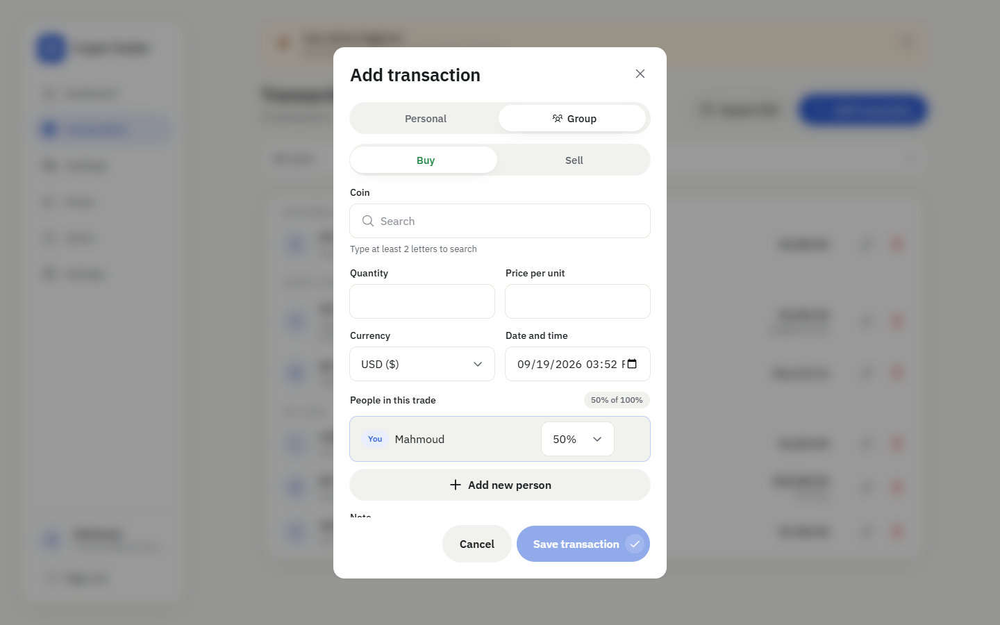
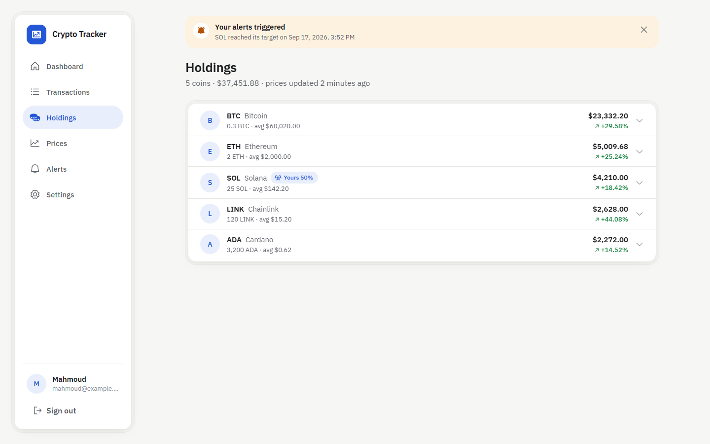
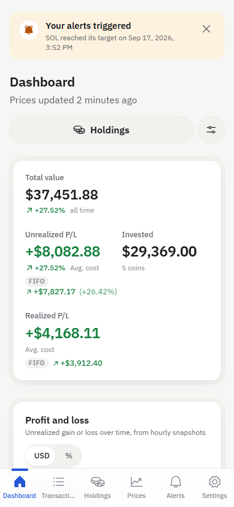
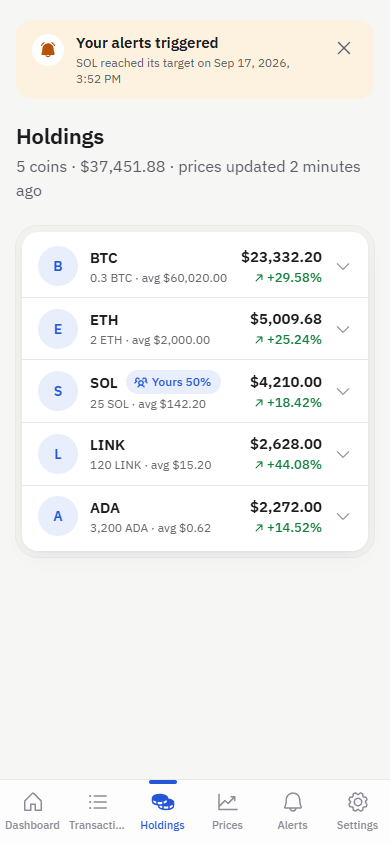
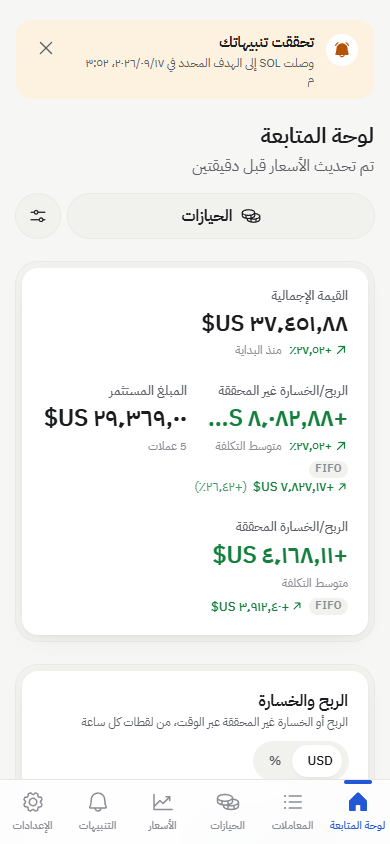

# Crypto Tracker

A personal crypto portfolio tracker I built for my father. He buys and sells coins by hand, and he wanted one place that answers three questions without any fuss: what do I own, what is it worth right now, and am I up or down.

That is the whole app. You log a buy or a sell, and the dashboard keeps a running picture of your holdings with live prices, profit and loss, and a chart of how things moved over time. It works the same on a phone and on a laptop, it speaks English and Arabic (full right to left layout), and because everything lives on the server, what you enter on one device shows up on the other a few seconds later.



## Who it is for

One non technical user who reads both English and Arabic, prefers big clear text, and does not want to learn a trading platform. That shaped every decision:

- Only two transaction types: buy and sell. No transfers, staking, swaps or airdrops.
- Sign in with Google and nothing else. No passwords to remember.
- Few screens, large tap targets, a large text mode, and light or dark theme.
- Profit is always green with a plus sign, loss is always red with a minus sign, so colour is never the only signal.

## What it does

### Dashboard

The first thing you see. Four numbers up top: total value, unrealized profit and loss, amount invested, and realized profit and loss. Under that, a profit and loss chart built from hourly snapshots of the portfolio, switchable between currency and percent and between ranges from 24 hours to all time. Then an allocation donut and the holdings list.

Profit and loss is shown two ways side by side. The main figure uses average cost. A smaller FIFO figure (first in, first out) sits next to it, so my father can compare the two without picking one.



### Transactions

Add, edit and delete buys and sells. Each entry has a coin (searched from the full CoinGecko list), quantity, price per unit, currency, date and time, and an optional note. A small fee of 0.1% is added automatically. A sell cannot exceed what you currently hold. The list is grouped by month and can be filtered by coin and by type.



### Group trades

Sometimes my father goes in on a coin together with friends. A group trade records everyone who took part and their share in whole percent, adding up to 100. The transaction list shows who was in on it, the holdings page flags the coin with a "Yours 50%" badge, and expanding that holding shows a "Your share" section that counts only his part of each group trade.



### Wallets

Trades can be kept in separate wallets, for example one per exchange account or hardware wallet. Every account starts with a "Main wallet" that holds everything already recorded; more can be added, renamed or deleted (a wallet with transactions in it cannot be deleted). Each transaction belongs to one wallet, chosen when it is added or edited, and a CSV import goes into the wallet picked on the import page.

The dashboard and the holdings page have a wallet switcher: "All wallets" shows the combined portfolio with a "By wallet" panel listing what each wallet is worth, and picking one wallet narrows every figure, the chart and the holdings list to that wallet alone. Sells are checked against what the same wallet holds, and the hourly snapshots are recorded per wallet as well as for the whole portfolio, so each wallet gets its own profit and loss line.

### Holdings

One row per coin: quantity held, average cost, current value and unrealized gain. Tap a row to expand it and see the transactions behind that position. Coins you hold through a group trade show your share as a badge.



### Live prices

Prices come from CoinGecko and refresh every 60 seconds while the app is open. The prices page shows every coin you own with its 24 hour change, plus a search box to look up any coin at all, owned or not. Coins you look up often can be pinned to a watchlist.

### Price alerts

Optional, off by default. Turn them on in settings, then create an alert for a coin, a target price and a direction (above or below). When it fires you get a push notification on your phone or desktop and a banner inside the app the next time you open it. An alert fires once, then you can re enable it or delete it.

### CSV import

If you already have a spreadsheet of trades, export it as CSV in the provided template (`date, coin, type, quantity, price, fee, note`), drop it on the import page, check the preview, and confirm. Rows with problems are highlighted and skipped, the rest go in.

### Settings

Language (English or Arabic), base currency (USD, EUR, SAR or TRY, converted with a live FX rate), large text, theme, alerts on or off, which dashboard charts to show and in what order, and sign out.

## Phone and Arabic

The app is a PWA, so it installs to the phone home screen and opens like a native app. On a phone the sidebar becomes a bottom tab bar. In Arabic the whole layout mirrors, including navigation, lists and charts.

<p>
  
  &nbsp;
  
  &nbsp;
  
</p>

## How it is built

A single Node.js server (Hono) serves the React app as static files and provides the API, the scheduled jobs and the push notifications, all on one origin. Data lives in Supabase Postgres, sign in goes through Supabase Auth with Google, and the whole thing deploys to Railway from GitHub.

| Layer          | Choice                                                                            |
| -------------- | --------------------------------------------------------------------------------- |
| Frontend       | React 19, TypeScript, Vite, Tailwind CSS, Recharts, react-i18next, TanStack Query |
| PWA            | vite-plugin-pwa (service worker, manifest, installability)                        |
| Backend        | Node.js 24, Hono                                                                  |
| Database       | Supabase Postgres via Drizzle ORM                                                 |
| Auth           | Supabase Auth (Google provider); the API verifies the Supabase JWT                |
| Scheduled jobs | node-cron in the same process: price refresh, alert checks, hourly snapshots, FX  |
| Push           | Web Push (VAPID)                                                                  |
| Market data    | CoinGecko                                                                         |
| FX rates       | open.er-api.com                                                                   |
| Deployment     | Railway                                                                           |

Portfolio maths (average cost, FIFO, group shares), validation schemas and the CSV parser live in a shared package used by both the API and the web app, so the numbers you see in the browser are computed by the same code the server uses.

## Running it locally

You need Node.js 24 and pnpm 12 (`npm i -g pnpm`).

```sh
cp apps/api/.env.example apps/api/.env       # Supabase values, see docs/DEPLOY.md
cp apps/web/.env.example apps/web/.env.local # Supabase values, see docs/DEPLOY.md
pnpm install
pnpm --filter @crypto-tracker/api db:migrate # apply Drizzle migrations
pnpm dev            # API on http://localhost:8787, web app on http://localhost:5173
pnpm build
pnpm typecheck
pnpm test
```

You can browse every screen without signing in or setting up a database by opening `http://localhost:5173/?mock=1` (add `&lang=ar` for Arabic). The mock layer is stripped from production builds.

## Project layout

```
crypto-tracker/
├── apps/
│   ├── web/          # React PWA
│   │   └── src/
│   │       ├── features/   # dashboard, holdings, wallets, transactions, prices, alerts, import, settings
│   │       ├── components/ # design system (Panel, StatCard, ListRow, Dialog, ...)
│   │       ├── i18n/       # en and ar strings, one file per feature
│   │       └── app/        # shell, auth, routes, settings provider
│   └── api/          # Hono server
│       └── src/
│           ├── routes/     # me, settings, transactions, prices, coins, portfolio, alerts, push, import
│           ├── services/   # coingecko, fx, cache, push
│           ├── cron/       # scheduled handlers
│           └── db/         # drizzle schema and client
├── packages/
│   └── shared/       # types, zod schemas, portfolio maths, CSV parser
└── docs/             # PRD, design system, deploy guide, screenshots
```
